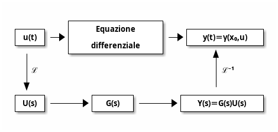

---
title: "Fondamenti di automatica: funzioni di trasferimento"
author: Marco Bonetti
...

# Funzioni di trasferimento  

## Dallo spazio degli stati alle trasformazioni funzionali  

i sistemi lineari stazionari possono essere espressi con equazioni differenziali ingresso-uscita di ordine $n$, del tipo:  

$$a_n\overset {\,n}{\dot {y}}+a_{n-1}\overset {\,n-1}{\dot {y}}+\cdots+a_0y=b_m\overset {\,m}{\dot {u}}+b_{m-1}\overset {\,m-1}{\dot {u}}+\cdots+b_0u$$  

$$\implies \sum_{j=0}^n a_j\overset {\,j}{\dot {y}}=\sum_{j=0}^n b_j\overset {\,j}{\dot {u}}$$  

Si noti che nell'equazione precedente l'ordine $n$ è il massimo ordine di derivata dell’uscita $y$, mentre l’ordine massimo di derivata dell’ingresso $u$ è indicato con $m$.  
Si supporrà sempre nel seguito $n\geq m$. Tale condizione non è restrittiva, in quanto corrisponde alla fisica realizzabilità del modello matematico  

Allo scopo di analizzare, con metodo indiretto e più semplice, l’equazione differenziale di ordine $n$ nella forma considerata, risultano di notevole utilità le trasformazioni funzionali, che associano funzioni nel dominio del tempo a funzioni in un altro dominio

## Trasformate di Laplace

La trasformazione funzionale più utile per l’analisi di equazioni differenziali è quella di Laplace.  
La trasformazione di Laplace associa una funzione $f(t)$ a valori reali del tempo ad una funzione $F(s)$ a valori in genere complessi, definiti per valori di $s$ complessi.  

$$F(s)=\mathcal{L}[f(t)]$$  

$$f(t)=\mathcal{L}^{-1}[F(s)]$$  

La trasformata di Laplace di $f(t)$ è definita come:  

$$F(s)=\int_{0}^{\infty}f(t)e^{-st}dt$$  

L'antitrasformata di Laplace di $F(s)$ è definita come:  

$$f(t)=\frac{1}{2\pi j}\int_{\sigma_0-j\infty}^{\sigma_0+j\infty}F(s)e^{st}ds$$  

### Proprietà  

- Lineareità
