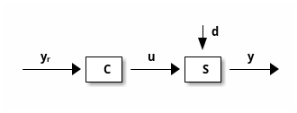
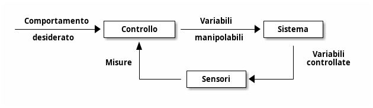
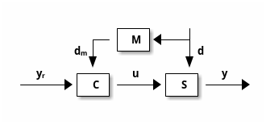
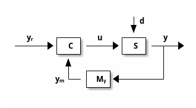
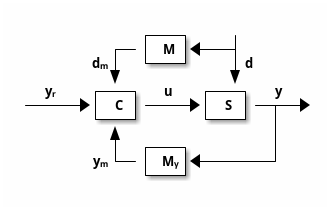

# Introduzione

## Concetti fondamentali

Controllo
: azione compiuta su un sistema, per modificarne il comportamento

Regolazione
: caso particolare di controllo il cui obiettivo è mantenere il comportamento del sistema controllato costante nel tempo

Automazione
: tecnologie preposte alla sostituzione del controllo umano nelle operazioni di un processo industriale di produzione

Automatica
: la disciplina orientata allo studio dei sistemi dinamici, del loro controllo e delle applicazioni di tale studio, non solo in campo industriale

## Controllo e strategie

Controllo ad azione diretta
: l'azione è determinata a priori in base al comportamento desiderato e alle sue relazioni fisiche e matematiche

Controllo in retroazione
: l'azione è determinata in base alle misure del comportamento effettivo del sistema ed al confronto di tale comportamento con quello desiderato

## Notazione

$S$
: sistema da controllare

$u$
: variabile manipolabile o di controllo

$y$
: variabile controllata

$d$
: disturbo

$C$
: controllore

## Strategie di controllo: generalizzazione

Controllo ad azione diretta
:

- $C$ utilizza solo il modello matematico di $S$, per determinare il valore di $u$ tale che (teoricamente) $y$ corrisponda a $y_r$

Controllo ad anello aperto con compensazione del disturbo
:

- $C$ utilizza il modello matematico di $S$ e le misure di $d$, per attuarne l'effetto sul valore della variabile controllata $y$

Controllo ad anello chiuso
:

- $C$ utilizza le misure di $y$ (indicate con $y_m$) per confrontarle ad ogni istante con $y_r$ ed agire di conseguenza

Controllo ad anello chiuso con compensazione del disturbo
:

## Requisiti di un sistema di controllo

Precisione statica
: quando $y_r$ è costante, anche $y$ deve essere costante e tale che $y=y_r$. Tipicamente si quantifica l'errore a regime
$$e=\lim_{t\to \infty}(y_r - y)$$

Precisione dinamica
: il periodo (detto transitorio) durante il quale $y$ si avvicina a $y_r$ deve essere di breve durata, con oscillazioni limitate

Insensitività ai disturbi
: il controllo è in grado di limitare l'effetto di disturbi esterni sulla precisione statica/dinamica

Robustezza
: le specifiche sulla precisione statica e dinamica devono essere garantite anche quando il processo da controllare ha caratteristiche differenti, entro certi limiti, dal modello matematico previsto

Moderazione
: il controllore non deve sollecitare il sistema da controllare con azioni troppo energetiche o irregolari anche per non violare limiti fisici degli attuatori
$$u_{\min}\leq u \leq u_{\max}$$
