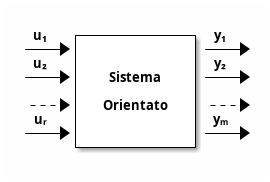

# Modellazione di sistemi dinamici

## Definizioni

### Sistemi e segnali

Sistema
: oggetto o dispositivo o fenomeno il cui comportamento si manifesta attraverso la variazione nel tempo di un certo numero di attributi misurabili

Variabili misurabili: caratteristiche di un sistema che si possono esprimere con uno o più numeri

Modello matematico
: relazioni che intercorrono tra le variabili misurabili di un sistema

Sistema orientato
: sistema le cui variabili misurabili si distinguono in ingressi e uscite

$$
\begin{pmatrix}
    u_1\\
    u_2\\
    \vdots\\
    u_r
\end{pmatrix}
    =u(t) \in \mathbb{R}^r
,\begin{pmatrix}
    y_1\\
    y_2\\
    \vdots\\
    y_m
\end{pmatrix}
    =y(t) \in \mathbb{R}^m
$$

Segnali analogici
: rappresentati da numeri reali associati ad un istante del tempo
$$t\in \mathbb{R}, y(t)\in \mathbb{R}$$

Segnali discreti
: rappresentati ancora da numeri reali, ma associati ad una successione di instanti di numeri interi
$$t_k\in \mathbb{Z}, y(t_k)\in \mathbb{R}$$

Segnali digitali
: segnali discreti ed inoltre rappresentati da numeri interi, così da poter essere memorizzati in stringhe di bit

Sistema discreto
: i segnali misurabili sono associati ad una successione di numeri interi detti passi

### Sistemi dinamici (a tempo continuo)

Un sistema si definisce dinamico se la sua risposta $y(t)$ ad un certo istante di tempo non è univocamente determinata dall'ingresso $u(t)$ allo stesso istante di tempo.  
Tipicamente, serve conoscere il valore passato di $u$, cioè in ogni istante compreso tra $t_0$ e $t$.  

### Sistemi dinamici (a tempo discreto)

Un sistema discreto si definisce dinamico se la sua risposta $y(k)$ ad un certo passo $k$ non è univocamente determinata dall'ingresso $u(k)$ allo stesso passo.  
Tipicamente, serve conoscere il valore passato di $u$, cioè per ogni passo compreso tra $0$ e $k$

### Sistema dinamico: variabili di stato  

La memoria del sistema dinamico viene definita stato ed è l'informazione da conoscere in $t_0$ per determinare $y(t), t\geq t_0$ noto $u(t), t\geq t_0$.  
Lo stato rappresenta l'effetto degli ingressi applicati prima di $t_0$, sull'uscita presente e futura.  
In generale lo stato è costituito da variabili raggruppate in un vettore di dimensione $n$, con $n$ detto ordine del sistema, ed al quale è associato uno spazio detto spazio degli stati:  

$$
\begin{pmatrix}
    x_1\\
    x_2\\
    \vdots\\
    x_n
\end{pmatrix}
    =x(t) \in \mathbb{R}^n
$$

### Modelli differenziali

Modello di un sistema dinamico nello spazio degli stati
:

- insieme dei tempi $T$
- insieme degli ingressi $U$
- insieme delle funzioni di ingresso $U_f$
- insieme degli stati $X$
- insieme delle uscite $Y$

Per i sistemi a tempo continuo si definisce modello differenziale vettoriale:  

$$
\begin{cases}
\frac{dx}{dt}(t)=f(x(t),u(t),t)\\
y(t)=g(x(t),u(t),t)
\end{cases}
$$  

$f$ è detta funzione di velocità di transizione dello stato  
$g$ è detta funzione di uscita  
$x(t)$ è il vettore di stato
$u(t)$ è il vettore di ingresso
$y(t)$ è il vettore di uscita

Per i sistemi a tempo discreto si usano equazioni alle differenze finite:  

$$
\begin{cases}
x(k+1)=f(x(k),u(k),k)\\
y(k)=g(x(k),u(k),k)
\end{cases}
$$  

$f$ in questo caso è detta funzione dello stato futuro  

Sistemi puramente algebrici
: senza stato  

$$y(t)=g(u(t),t)\quad \text{o}\quad y(k)=g(u(k),k)$$

Sistemi puramente dinamici
: non c'è $u$ nella funzione di uscita  

$$
\begin{cases}
\frac{dx}{dt}(t)=f(x(t),u(t),t)\\
y(t)=g(x(t),t)
\end{cases}
\quad o \quad
\begin{cases}
x(k+1)=f(x(k),u(k),k)\\
y(k)=g(x(k),k)
\end{cases}
$$

Sistemi dinamici stazionari
: le funzioni di stato/uscita non dipendono esplicitamente da t o k  

$$
\begin{cases}
\frac{dx}{dt}(t)=f(x(t),u(t))\\
y(t)=g(x(t))
\end{cases}
\quad o \quad
\begin{cases}
x(k+1)=f(x(k),u(k))\\
y(k)=g(x(k))
\end{cases}
$$

Sistemi dinamici lineari
: le funzioni $f$ e $g$ sono lineari rispetto a $x$ e $u$ per ogni $t$, sono quindi esprimibili con prodotti tra matrici e vettori  

$$
\begin{cases}
\frac{dx}{dt}(t)=A(t)x(t)+B(t)u(t)\\
y(t)=C(t)x(t)+D(t)u(t)
\end{cases}
\quad o \quad
\begin{cases}
x(k+1)=A(k)x(k)+B(k)u(k)\\
y(k)=C(k)x(k)+D(k)u(k)
\end{cases}
$$

Sistemi dinamici lineari e stazionari
: matrici $A$, $B$, $C$ e $D$ costanti nel tempo  

$$
\begin{cases}
\frac{dx}{dt}(t)=Ax(t)+Bu(t)\\
y(t)=Cx(t)+Du(t)
\end{cases}
\quad o \quad
\begin{cases}
x(k+1)=Ax(k)+Bu(k)\\
y(k)=Cx(k)+Du(k)
\end{cases}
$$

Sistemi MIMO (Multi-Input Multi-Output)
:  
$$m>1\quad \text{e} \quad r>1$$

Sistemi SISO (Single-Input Single-Output)
:  
$$m=1\quad \text{e} \quad r=1$$

### Riassumendo: classificazione dei modelli

|             | Stazionario                                         | Non stazionario                                               |
| ----------- | --------------------------------------------------- | ------------------------------------------------------------- |
| Lineare     | $\frac{dx}{dt}(t)=Ax(t)+Bu(t)\\ y(t)=Cx(t)+Du(t)$   | $\frac{dx}{dt}(t)=A(t)x(t)+B(t)u(t)\\ y(t)=C(t)x(t)+D(t)u(t)$ |
| Non lineare | $\frac{dx}{dt}(t)=f(x(t),u(t))\\ y(t)=g(x(t),u(t))$ | $\frac{dx}{dt}(t)=f(x(t),u(t), t)\\ y(t)=g(x(t),u(t), t)$     |

### Risposta di un sistema dinamico a tempo continuo

La soluzione dell'equazione differenziale:  

$$\frac{dx}{dt}(t)=f(x(t),u(t),t);\quad x(t_0)=x_0$$  

che si suppone esistere ed essere unica è del tipo  

$$x(t)=\phi(t, t_0, x(t_0), u);\quad x(t_0)=x_0$$  

si definisce funzione di transizione dello stato

Proprietà base della funzione di transizione  dello stato

- Composizione
    : se $x(t_1)=\phi(t_1, t_0, x(t_0), u); \quad t_0\leq t_1 \leq t$  
      $\implies x(t)=\phi(t, t_0, x(t_0), u)=\phi(t, t_1, x(t_1), u)$

Sostituendo la funzione di transizione dello stato nella funzione di uscita:  

$$y(t)=g(\phi(t,t_0, x(t_0), u), u(t), t)$$  

si ottiene la funzione di risposta:  

$$y(t)=\gamma(t, t_0, x(t_0), u)$$  

e si passa dal modello differenziale ingresso-stato-uscita al modello ingresso-stato-uscita nel quale sono fissate le condizioni iniziali su $x(t_0)$  

$$
\begin{cases}
\frac{dx}{dt}(t)=f(x(t),u(t),t)\\
y(t)=g(x(t), u(t), t)
\end{cases}
\quad \implies \quad
\begin{cases}
x(t)=\phi(t, t_0, x(t_0), u)\\
y(t)=\gamma(t, t_0, x(t_0), u)
\end{cases}
$$
